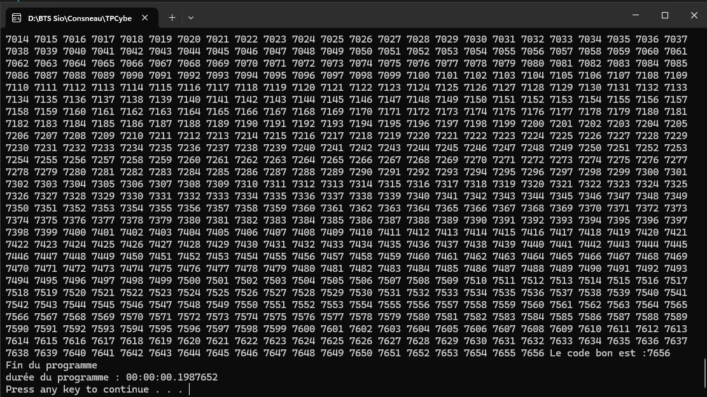

# Compte rendu 🚀 TP - 06. SLAM - CSharp - Casser Code PIN

## Questions

1. **Quelle est la durée de ce programme en secondes ?**

La durée du programme est de 0,014 secondes.

2. **En millisecondes (ms) ?**

14 millisecondes.

3. **Résultat (fournissez une impression ecran)**

4. **Quelle est la durée du programme en secondes ?**

La durée du programme en secondes est de 0.19 secondes.

---

### 🔄 Étude de la temporisation dans la boucle while

**1. Ajoutez une temporisation de `5 millisecondes (ms)` dans la boucle `while` :**

**Question :**
> **Quelle est sa durée ?**

1 minutes et 1 secondes.

**2. Mettez maintenant une temporisation de `1 seconde (= 1 000 ms)`.**

**Question :**
> **Quel est l’effet sur l’attaquant ?**

L'attaquant va avoir beaucoup plus de mal car le délais ente chaque mot de passe est trop long. Dans notre exemple cela peut prendre jusqu'à 10 000 secondes.

